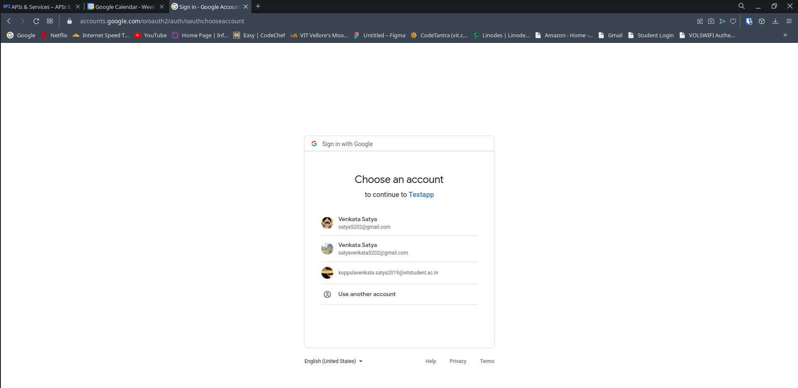

# Django Assignment by CONVIN

**Problem:**  In this assignment you have to implement google calendar integration using django rest api. You need to use the OAuth2 mechanism to get users calendar access. Below are detail of API endpoint and corresponding views which you need to implement


**/rest/v1/calendar/init/ -> GoogleCalendarInitView()**

This view should start step 1 of the OAuth. Which will prompt user for
his/her credentials

**/rest/v1/calendar/redirect/ -> GoogleCalendarRedirectView()**

This view will do two things
1. Handle redirect request sent by google with code for token. You
need to implement mechanism to get access_token from given
code
2. Once got the access_token get list of events in users calendar

Create a .env file and have these

```
DJANGO_GOOGLE_OAUTH2_CLIENT_ID=<your-client-id>
DJANGO_GOOGLE_OAUTH2_CLIENT_SECRET=<your-client-secret>
DJANGO_SECRET=<django-secret-key>
```

Get oAuth client id and client secret [Here](https://developers.google.com/identity/gsi/web/guides/get-google-api-clientid) from Google

Download client_secret.json from dashboard and paste it in root folder of the project


## Images of application Running in local host 
Working




Since it's in testing user need to continue 


